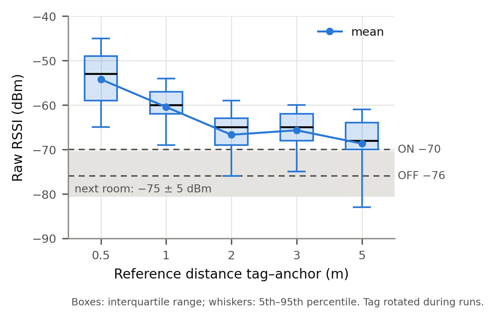
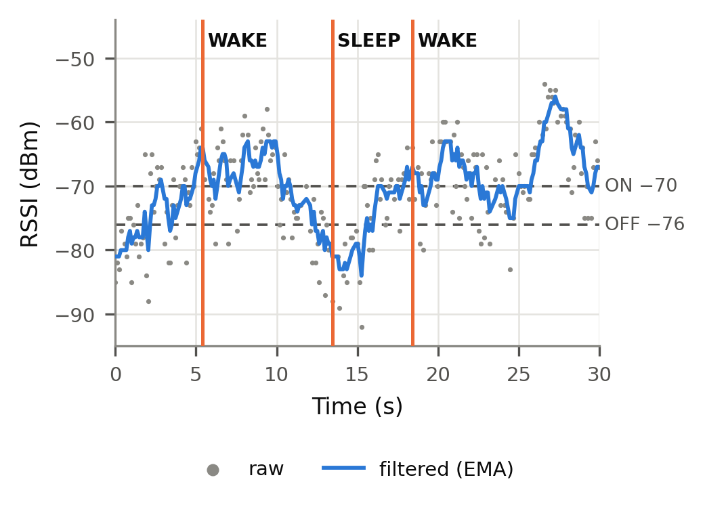
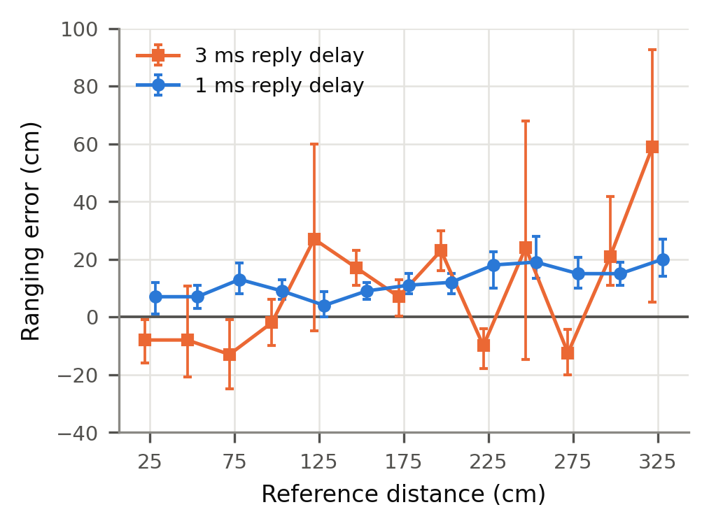
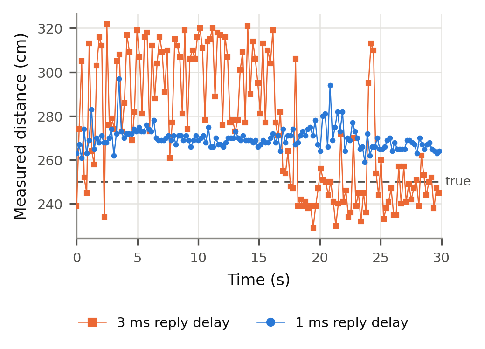

# UWB Smart Audio Follow

**Music that follows you from room to room.** A small battery tag decides which
speaker is nearest to the user, using cheap Bluetooth for presence detection and
Ultra-Wideband (UWB) radio for centimetre-level distance, so the precise (and
power-hungry) radio only runs when it is needed.

`Embedded C` · `Zephyr RTOS / nRF Connect SDK` · `BLE` · `UWB (DW3110)` · `Python` · `Low-power design`

## The problem

To pick the closest speaker you need to know how far the user is from each one.
Two obvious options both fall short:

- **Bluetooth signal strength (RSSI)** is cheap, but it is a poor distance
  measure. In my measurements the tag's orientation alone changed it by up to 10 dB.
- **UWB ranging** is accurate to centimetres, but the radio draws about 18 mA
  when idle and about 40 mA when active, which is too much to leave running on a battery tag.

## The approach

Use each radio for what it is good at.

1. **BLE as a trigger.** The tag advertises about every 100 ms. Each anchor
   filters the RSSI and decides whether the tag is in its room, with hysteresis
   so it does not flicker (`WAKE` / `SLEEP`).
2. **UWB only when needed.** While the tag is in range, the anchor measures
   distance with single-sided two-way ranging (SS-TWR). Otherwise the UWB chip
   sleeps (0.85 µA in deep sleep, against 18 mA idle).
3. **A server decides.** Three anchors, one per speaker, send their distances to a
   server that picks the nearest one. A switching margin and confirmation count
   stop it flipping between speakers.

```
 tag --BLE advert--> anchor 1 ┐
     <--UWB range--> anchor 2 ├── serial --> server (Python) --> nearest speaker
                     anchor 3 ┘
```

## What I built

- **Tag firmware:** BLE advertiser that sends one event at a time, then opens a
  short UWB listening window and answers range requests.
- **Anchor firmware:** BLE scanner with an EMA-filtered RSSI state machine, plus a
  UWB initiator. The three anchors take turns in their own time slots so their
  replies do not collide.
- **UWB driver integration:** SS-TWR with clock-offset correction on the DW3110
  (Zephyr driver port), SPI at 32 MHz, antenna-delay calibration, deep sleep and wake.
- **Server:** nearest-anchor decision logic with hysteresis, CSV logging, and LED
  commands back to the anchors (the demo uses an LED in place of a speaker).
- **Measurement tooling:** Python loggers for RSSI and UWB runs, and scripts that
  generate the figures below from the logged CSV files.

## Results

### 1. BLE RSSI is good for "which room", not "how far"

| Distance | Mean RSSI |
|---|---|
| 0.5 m | −54 dBm |
| 1 m | −60 dBm |
| 2 m | −66 dBm |
| 3 m | −65 dBm |
| 5 m | −68 dBm |
| next room | about −75 dBm |

The curve flattens beyond about 2 m and orientation adds up to 10 dB of spread,
so RSSI cannot rank two nearby anchors. The next room is clearly weaker than the
same room, which makes it a reliable presence trigger.



Walking into the room, out, and in again. The filtered RSSI crosses the
thresholds and the anchor raises `WAKE` / `SLEEP` as expected. With thresholds
of −76 / −82 dBm, `WAKE` came at about 7 m and `SLEEP` at about 9 m.



### 2. UWB ranging: the reply delay mattered most

- 100 % of the ranging exchanges succeeded.
- A **3 ms** reply delay gave errors of −13 to +59 cm and jumpy readings. The
  clock-offset error grows with the reply delay. At **1 ms** the error was +4 to +20 cm.
- After calibrating the antenna delay, the median error was **+1 to +6 cm at
  1 to 2 m**.
- At 2.5 m and 3 m the error grew to +18 and +21 cm. Those runs were in a
  passage only 1 m wide, so multipath is the likely cause (not yet confirmed in an open space).

| True distance | Median error (calibrated) | 5th–95th percentile |
|---|---|---|
| 100 cm | +1 cm | −2 … +4 cm |
| 150 cm | +6 cm | +1 … +8 cm |
| 200 cm | +4 cm | +2 … +7 cm |
| 250 cm | +18 cm | +13 … +51 cm |
| 300 cm | +21 cm | +16 … +28 cm |



*Error for the 3 ms and 1 ms reply delay, before calibration.*



*Every measurement at 2.5 m. The long reply delay jumps between levels.*

### 3. BLE and UWB together

On one anchor and one tag, 316 of 316 ranging attempts succeeded. Ranging worked
up to about 7–8 m and failed beyond about 8–9 m, which is enough for anchors
placed up to 5 m apart.

### 4. Power

Datasheet currents for the UWB chip (channel 5):

| State | Current |
|---|---|
| Deep sleep | 0.85 µA |
| Idle | 18 mA |
| RX / TX | about 40 mA |

Deep sleep removes the idle current. On the tag, the 25 ms UWB listening window
after each advertisement is the largest remaining cost, and the obvious next step
is to shorten it or gate it with the on-board accelerometer.

## What I learned

- Ranging accuracy depends on the **timing budget**, not only on the radio. The
  reply delay, SPI speed and clock offset together decided whether the result
  was jumpy or stable.
- Cheap and precise sensors work best as a **pair**: let the cheap one decide
  *when* to use the expensive one.
- Hysteresis and confirmation counts, in the RSSI trigger and in the server's
  choice of speaker, matter more for a good demo than raw accuracy.
- A measurement is only useful with its **setup** written down. The 2.5–3 m error
  made sense only after I noted the narrow passage.

## Status and limitations

- **Tested on hardware:** BLE trigger and thresholds, UWB ranging and
  calibration, and the combined BLE + UWB system on one anchor.
- **Implemented, hardware testing in progress:** three-anchor turn-taking, UWB deep
  sleep and the server with LED indication.
- Distance results above 2 m were measured in a narrow passage. An open-space
  run is still to do.
- Power figures are from the datasheet. A current measurement of the finished
  tag is still to do.

## Repository layout

| Folder | Content |
|---|---|
| `BLE_RSSI/` | Stage 1: BLE tag (advertiser) and anchor (scanner, RSSI filter, `WAKE`/`SLEEP`) |
| `UWB_ranging/` | Stage 2: UWB SS-TWR initiator and responder |
| `UWB_and_BLE/` | Stage 3: combined BLE trigger + UWB ranging |
| `figures/` | Result figures used in this README |

## Credits

Built with the [Qorvo DWM3001CDK](https://www.qorvo.com) and Nordic's nRF Connect
SDK. UWB driver port by [br101](https://github.com/br101/zephyr-dw3000-decadriver).
